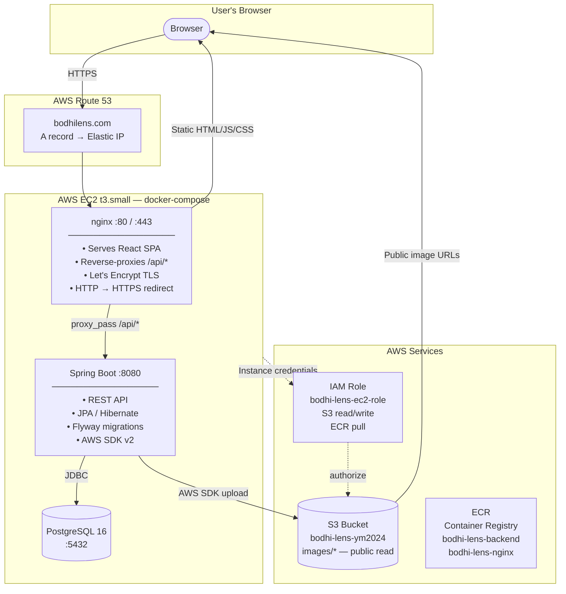
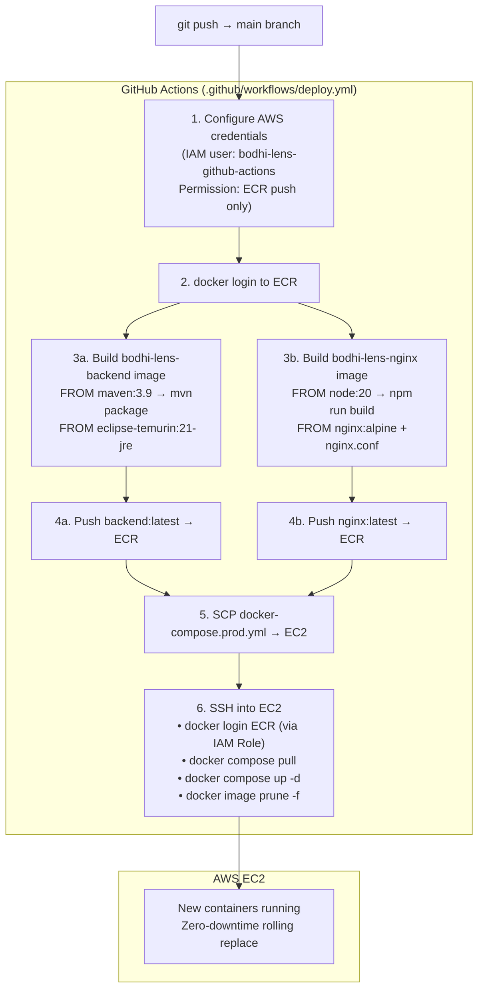
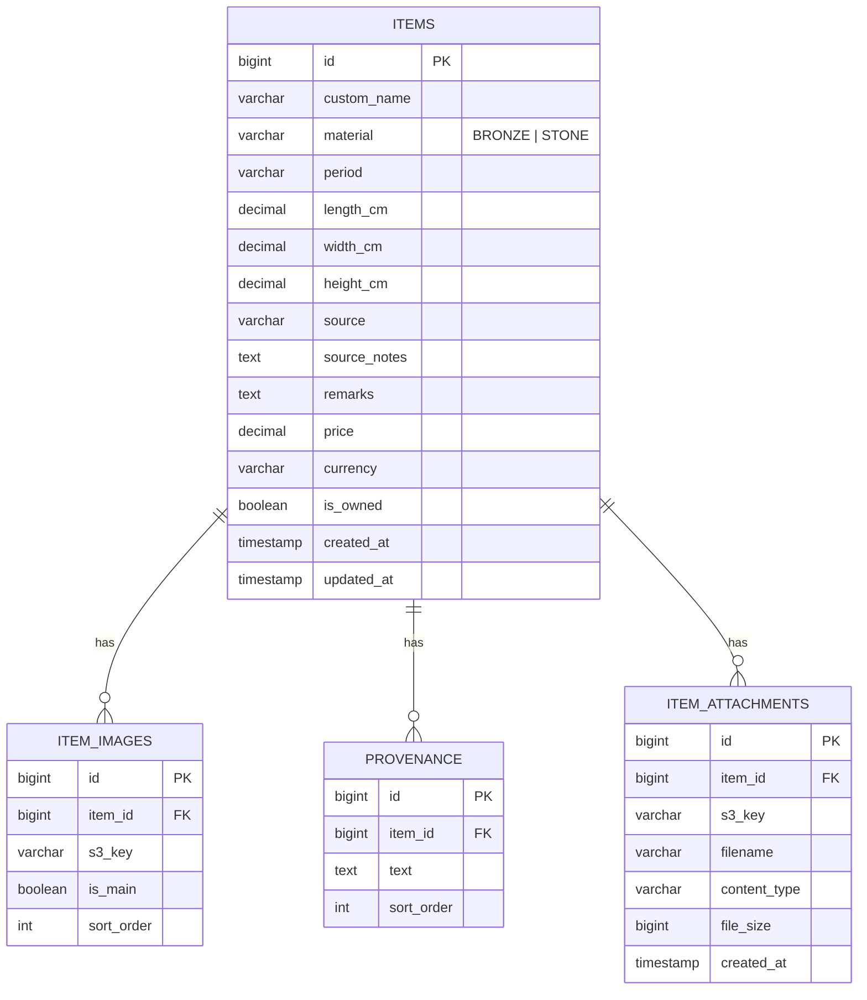
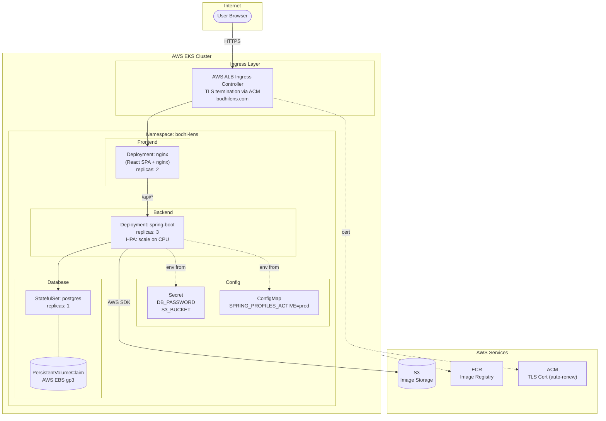

# Bodhi Lens

Personal Buddhist art catalog — track bronze and stone pieces with images, provenance,
dimensions, pricing, and scanned documents. Live at **[bodhilens.com](https://bodhilens.com)**.

---

## System Architecture



**Key design decisions:**
- nginx and the React SPA share the same origin (`bodhilens.com`), so API calls use relative
  URLs (`/api/...`) — no CORS needed from the browser's perspective.
- EC2 carries an **IAM Role** instead of stored credentials. AWS SDK auto-discovers
  them via Instance Metadata Service (IMDS). Nothing secret lives on disk.
- Images are uploaded *through the backend* (not directly from the browser to S3),
  keeping the upload endpoint behind application logic.

---

## CI/CD Pipeline



**Two separate IAM principals:**

| Principal | What it can do | Where credentials live |
|-----------|---------------|----------------------|
| `bodhi-lens-github-actions` (IAM user) | Push images to ECR | GitHub Actions Secrets |
| `bodhi-lens-ec2-role` (IAM Role) | S3 read/write, ECR pull | Auto-injected by AWS — nothing stored |

---

## Tech Stack

| Layer | Technology | Why |
|-------|-----------|-----|
| Frontend | React 18 + Vite + TypeScript | Component model fits a catalog UI; fast HMR in dev |
| UI Library | Ant Design 5 | Rich ready-made components (Table, Drawer, Upload, DnD) |
| State / Data | React Query | Server-state caching, background refetch, loading states |
| Backend | Spring Boot 3.2 (Java 21) | Mature ecosystem; JPA makes relational mapping easy |
| ORM | Hibernate / Spring Data JPA | Entity relationships, lazy loading, specification queries |
| Migrations | Flyway | Version-controlled schema; runs on startup, never manual SQL |
| Database | PostgreSQL 16 | Relational model fits Item → Images → Provenance hierarchy |
| Object Storage | AWS S3 | Durable, cheap, public CDN URLs for images |
| Containerisation | Docker + docker-compose | One command local start; same images in production |
| Reverse Proxy | nginx | Static file serving + API proxy + TLS termination |
| TLS | Let's Encrypt / Certbot | Free, auto-renewable certificates |
| Registry | AWS ECR | Private container registry, integrates with IAM |
| IaC | Terraform | EC2, EIP, S3, ECR, IAM, Route 53 all version-controlled |
| CI/CD | GitHub Actions | Push-to-deploy; no extra tooling needed |

---

## Data Model



Schema is managed by **Flyway** (`V1` → `V6` migration files). Each feature addition
(new column, new table) gets a new numbered migration — no manual `ALTER TABLE` in production.

---

## Key Features

| Feature | Implementation |
|---------|---------------|
| **Masonry catalog** | CSS `columns` layout; click any card to open detail drawer |
| **Multi-filter** | Client-side `useMemo` — material, period, source, owned, free-text |
| **CJK search** | `opencc-js` converts query to both simplified/traditional; matches either |
| **Image upload** | Ant Design `Upload.beforeUpload` → axios multipart → S3 via backend |
| **Batch upload** | Sequential `for...of` loop inside the first file's callback; avoids race condition |
| **Drag-to-reorder** | `@dnd-kit/core` sortable; first image auto-becomes cover |
| **Lotus lock screen** | SVG petals all overlap (bud) → CSS `rotate()` spread on correct password |
| **Sort by recency** | Backend: `Sort.by(DESC, "updatedAt")` on the JPA query |
| **HTTPS** | Let's Encrypt cert mounted into nginx container via docker-compose volume |

---

## Bugs Fixed in Production (Real War Stories)

### 1. CORS 403 after HTTPS migration
**Symptom:** Image upload returned 200 from `curl` but 403 from the browser after switching to HTTPS.

**Root cause:** Modern browsers send an `Origin` header on every `POST` — even same-origin
requests. Spring's `CorsFilter` checked `Origin: https://bodhilens.com` against the whitelist
(`localhost` only) and rejected it. `curl` doesn't send `Origin` by default, masking the issue.

**Fix:** Added `https://bodhilens.com` to `WebConfig.allowedOrigins`.

**Lesson:** CORS is a *server-side* allowlist checked against the `Origin` header, not purely
a cross-origin browser concern.

---

### 2. Production backend connecting to localhost MinIO
**Symptom:** After deploying, image upload threw a connection error to `localhost:9000`.

**Root cause:** `application-prod.yml` did not override `endpoint`, `access-key`, `secret-key`
from the base `application.yml`. Spring merges profiles — it doesn't null-out parent keys.

**Fix:** Explicitly set all three to `""` in the prod profile. Code checks `if (accessKey.isBlank())
→ use DefaultCredentialsProvider (IAM Role)`.

**Lesson:** Spring profile merging is additive; you must explicitly override keys you want cleared.

---

### 3. Batch image upload only saving one image
**Symptom:** Selecting 3 files from the picker → only 1 appeared after upload.

**Root cause:** Ant Design calls `beforeUpload(file, fileList)` once per file. All three calls
fired concurrently, each reading the same stale React state (`value = []`) and each calling
`setState([...value, newImage])` — a classic closure-over-stale-state race condition.

**Fix:** Return early for files that are not `fileList[0]`. The first file's callback does a
sequential `for...of` loop, uploads all files, and calls `setState` once at the end.

---

## Infrastructure (Terraform)

All AWS resources are defined in `infra/main.tf`:

```
EC2 t3.small          — application host
Elastic IP            — permanent IP (survives reboots)
S3 bucket             — image & attachment storage, public read on images/*
ECR (×2)              — bodhi-lens-backend, bodhi-lens-nginx
IAM Role              — EC2 instance role (S3 + ECR)
IAM User              — GitHub Actions (ECR push only)
Route 53 A record     — bodhilens.com → Elastic IP
Key pair              — SSH access (pem file gitignored)
Security Group        — ports 22, 80, 443 open
```

```bash
cd infra
terraform init
terraform apply          # creates all 17 resources
terraform destroy        # tears everything down
```

---

## Local Development

```bash
# 1. Start Docker infrastructure (PostgreSQL + MinIO)
docker compose up -d

# 2. First run: make MinIO bucket public
docker exec bodhi-lens-minio-1 mc alias set local http://localhost:9000 minioadmin minioadmin
docker exec bodhi-lens-minio-1 mc mb local/bodhi-lens 2>/dev/null || true
docker exec bodhi-lens-minio-1 mc anonymous set public local/bodhi-lens

# 3. Start backend
cd backend && mvn spring-boot:run

# 4. Start frontend (new terminal)
cd frontend && npm run dev
# → http://localhost:5173
```

| Service | URL | Credentials |
|---------|-----|-------------|
| Frontend | http://localhost:5173 | — |
| Backend API | http://localhost:8080/api | — |
| MinIO Console | http://localhost:9001 | minioadmin / minioadmin |
| PostgreSQL | localhost:5432 | postgres / postgres, db: bodhi_lens |

---

## Docker Images

### Backend (`backend/Dockerfile`)
Two-stage build — Maven compiles in the build stage, only the JRE and the JAR ship in the
final image. Keeps the image small (~200 MB vs ~600 MB with full JDK + Maven).

```
Stage 1: maven:3.9-eclipse-temurin-21-alpine
  → mvn dependency:go-offline
  → mvn package -DskipTests

Stage 2: eclipse-temurin:21-jre-alpine
  → COPY app.jar
  → ENTRYPOINT java -jar app.jar
```

### Frontend + nginx (`nginx/Dockerfile`)
Two-stage build — Node builds the React app, only the compiled `dist/` and nginx config
ship in the final image.

```
Stage 1: node:20-alpine
  → npm ci
  → npm run build          (Vite → dist/)

Stage 2: nginx:alpine
  → COPY dist/ → /usr/share/nginx/html
  → COPY nginx.conf
```

---

## Kubernetes — How This Would Look at Scale

The current setup uses **docker-compose on a single EC2**. That's the right choice for a
personal project (simple, cheap, no cluster overhead). Here's how it maps to Kubernetes,
which you'd reach for when you need **horizontal scaling, rolling deploys, or a managed
cloud-native environment (EKS/GKE/AKS)**.

### docker-compose → Kubernetes concept mapping

| docker-compose | Kubernetes equivalent | Purpose |
|---------------|----------------------|---------|
| `service: backend` | `Deployment` + `ClusterIP Service` | Run N replicas, internal DNS |
| `service: nginx` | `Deployment` + `Service` + `Ingress` | Edge routing, TLS |
| `service: postgres` | `StatefulSet` + `PersistentVolumeClaim` | Stable identity, durable storage |
| `.env` file | `Secret` | Encrypted at rest in etcd |
| `restart: unless-stopped` | `livenessProbe` + `restartPolicy: Always` | Health-based restart |
| `docker compose pull` | `kubectl rollout restart` | Rolling zero-downtime update |
| `ports: 80:80` | `Ingress` (nginx-ingress / AWS ALB) | L7 routing, cert management |

### K8s Architecture Diagram



### Why docker-compose is fine here (and when to upgrade)

**Stay on docker-compose when:**
- Single user / personal project
- Traffic is predictable and low
- You don't need multiple replicas
- Operational simplicity matters more than resilience

**Upgrade to Kubernetes when:**
- You need **horizontal pod autoscaling** (e.g., burst traffic)
- You need **rolling deploys** with zero downtime and easy rollback
- You're running **multiple services** that need service discovery
- You have a **team** and need namespace isolation / RBAC
- You're on a **managed cloud service** (EKS/GKE) and want AWS to handle node upgrades

**The migration path would be:**
1. Replace `docker-compose.prod.yml` with Kubernetes manifests (Deployment, Service, Ingress, Secret)
2. Replace EC2 with an EKS cluster (or use a managed service like Railway / Render for simpler K8s-like experience)
3. Replace Let's Encrypt + certbot with AWS Certificate Manager (handles renewal automatically)
4. Replace the S3 config in docker-compose env with a Kubernetes Secret

The application code itself doesn't change — only the deployment descriptor format changes.
